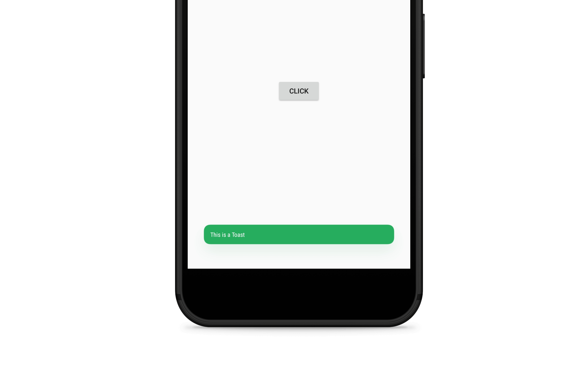

# Toaster
Use this library to make your boring toasts bit colorful. More methods will be added soon.




Adding it to your project
===========
```groovy
allprojects {
		repositories {
			maven { url 'https://jitpack.io' }
		}
	}
```

Android Studio 3.0 and above:

```groovy
dependencies {
    implementation 'com.github.evanemran:Toaster:1.1'
}
```

Android Studio 2.3.* and lower:

```groovy
dependencies {
    compile 'com.github.evanemran:Toaster:1.1'
}
```
How to use the dialog
=====================
Example:

    Toaster toaster = new Toaster(MainActivity.this, "This is a Toast");
                toaster.setBackground("#1FAA59");
                toaster.setTextColor("#FFFFFF");
                toaster.show();
